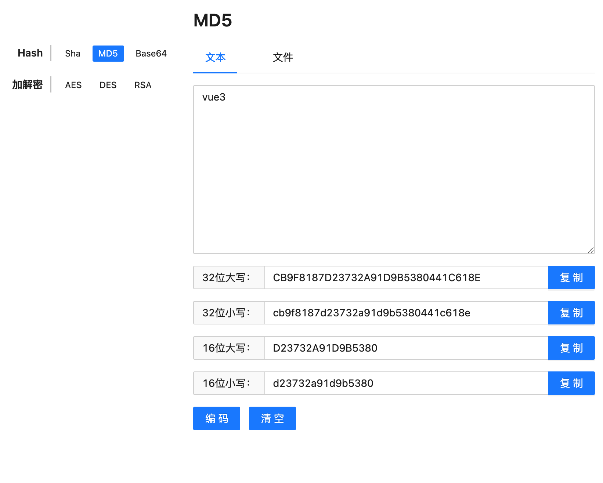
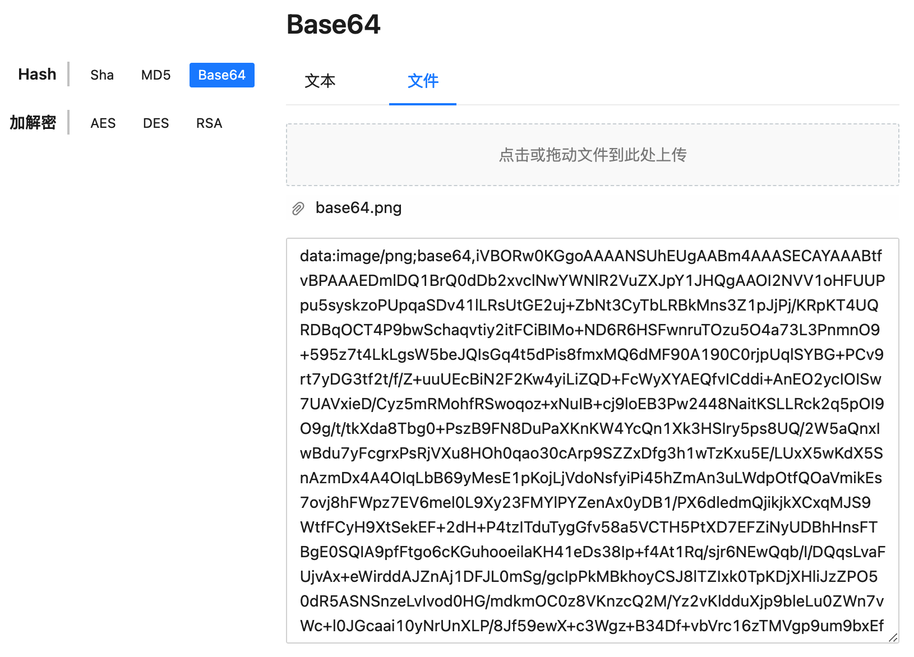
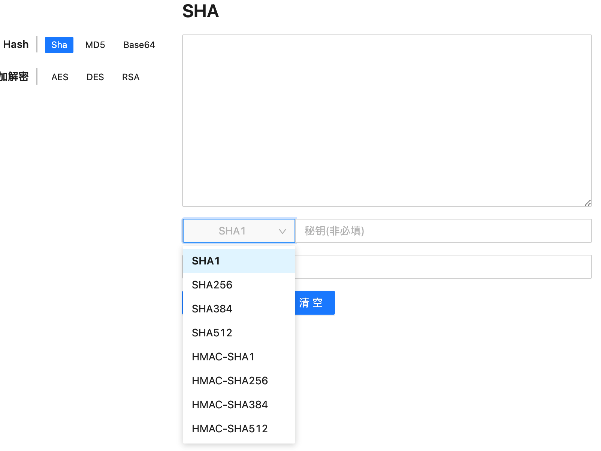
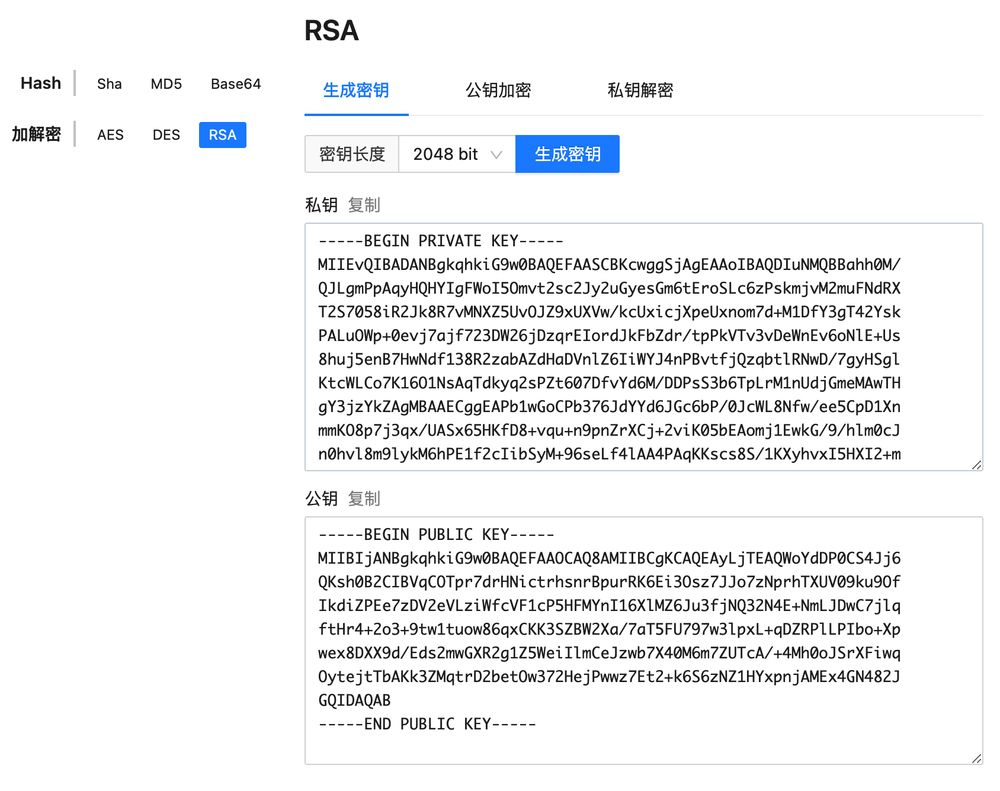
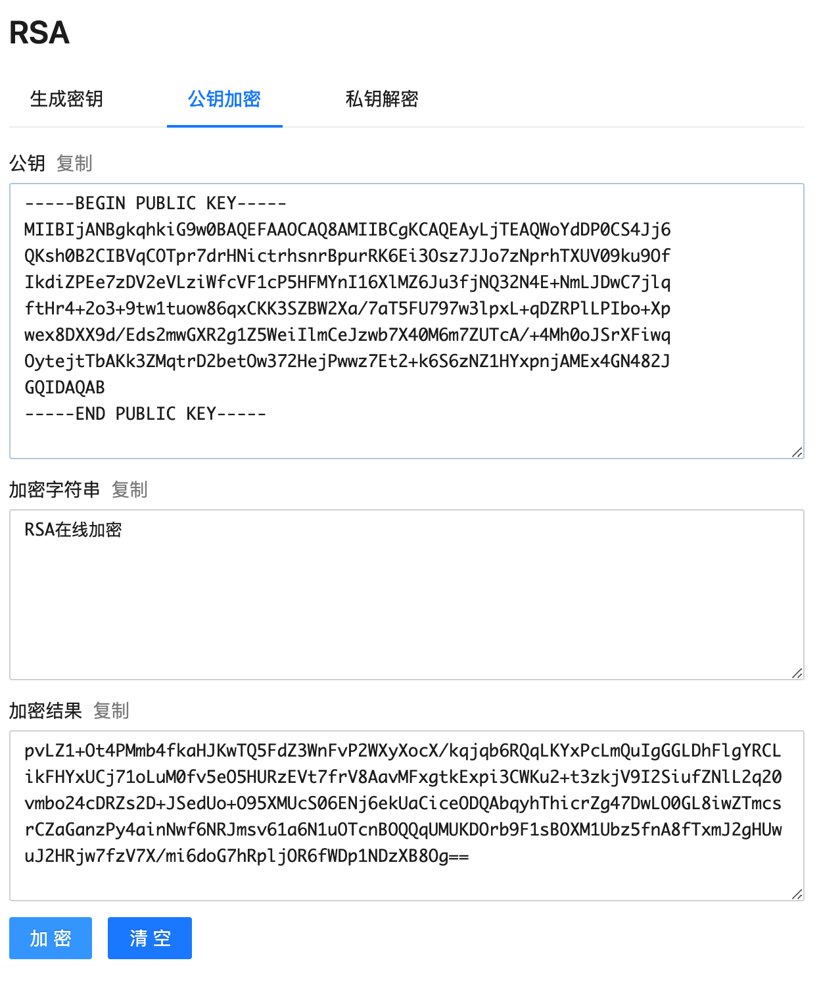
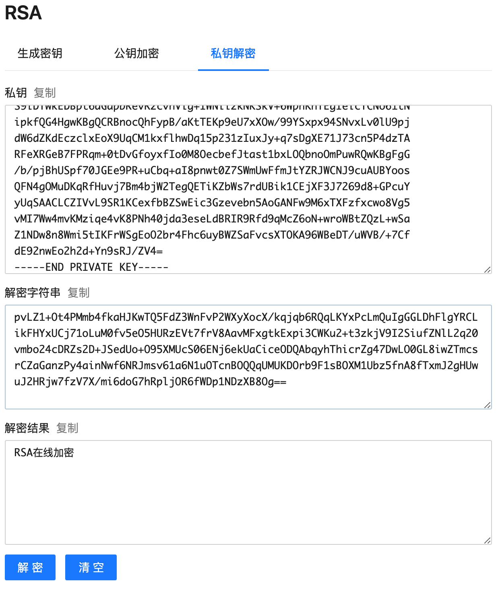

<h1 align="center">Vue 3 + Typescript + Vite</h1>

前端在线加解密工具网

### 加密支持
|  加密算法   | 是否支持  |
|  ----  | ----  |
| MD5  | 支持 |
| Base64  | 支持 |
| SHA  | 支持 |
| RSA  | 支持 |
| AES  | 支持 |
| DES  | 支持 |

### MD5

### Base64

### SHA

### RSA

## 感谢
- [Vue](https://github.com/vuejs/vue)
- [Vue-Router](https://github.com/vuejs/vue-router-next)
- [Ant](https://2x.antdv.com/components/overview-cn)
- [Web Cryptography API](https://www.w3.org/TR/WebCryptoAPI)
- [crypto-js](https://cryptojs.gitbook.io/docs/)

